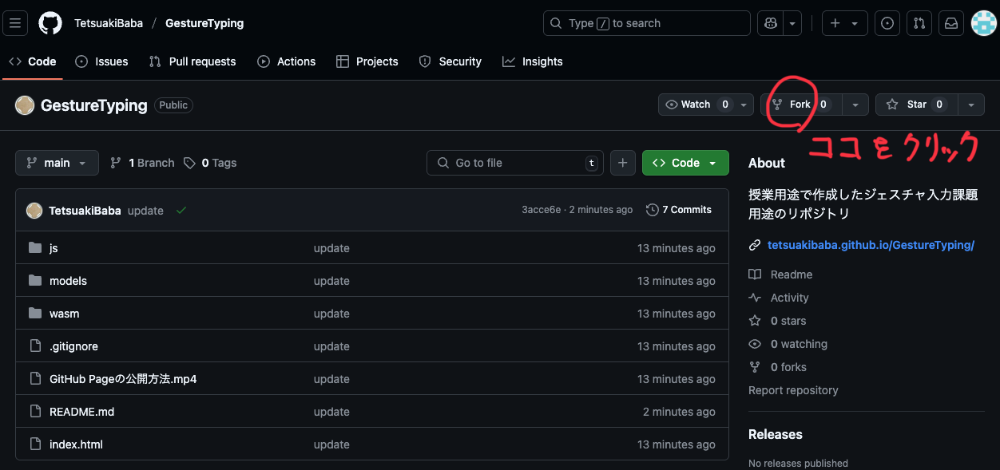

# GestureTyping
このリポジトリは授業内での学習を目的としたものです。履修者は以下の手順で課題作成に参加してください。

# 手順
1. 下記画像を参照してこのリポジトリをフォーク（自分のリポジトリとしてコピーを作成する）してください。
   
2. フォークしたリポジトリをローカルにクローンしてください。授業では下記のようにコマンドラインを利用しましたが、GitHub DesktopなどのGUIツールを使用しても構いません。
   ```
   git clone your-forked-repo-url
   cd GestureTyping
   ```
3. vscodeで課題を作成し、ローカルで動作確認を行ってください。
4. 動作確認が完了したら自分のリモートリポジトリにプッシュしてください。
    ```
    git add .
    git commit -m "更新分のコメント（updateとか、なんでもよい）"
    git push origin main
    ```
5. 以下の動画を参照して、GitHub Pageを公開し、作成されたリンクから自身のGestureTypingの動作を確認してください。

https://github.com/user-attachments/assets/3cfa0023-0c06-41e3-a0fc-677b6c3b0a2e

6. GitHub PageのURLを teams で提出してください。

# 制作の注意点（必ず読んでください）
- 用いるジェスチャー認識に利用する学習済みモデルは必ず自分で作成したオリジナルなものを利用してください。
- サンプルでは両手を使っていますが、片手でも構いません。
- エラー率ではなく、どれだけ早く任意の文字列を入力できるかを競います。
- 単語ごとではなく、ジェスチャと文字は1対1で対応させてください。

# 編集箇所
## カスタム学習済みモデルの読み込み
作成した学習済みモデルを models フォルダに配置し、script.jsの以下のモデルファイル名を変更してください。
```javascript
modelAssetPath: "./models/gesture_recognizer.task",
```

## 主な編集箇所
基本的には sketch.js のみを編集してください。またプログラム内にて、「ここから下は編集しないでください」とコメントアウトしている箇所がありますので、それより上の行のみを編集してください。ただしシステムの実装にあたり、draw()関数ないやその他の記述を編集する必要がある場合は、ご自身の判断で編集していただいて構いませんが、ゲームのルールに反するような編集は行わないでください。

